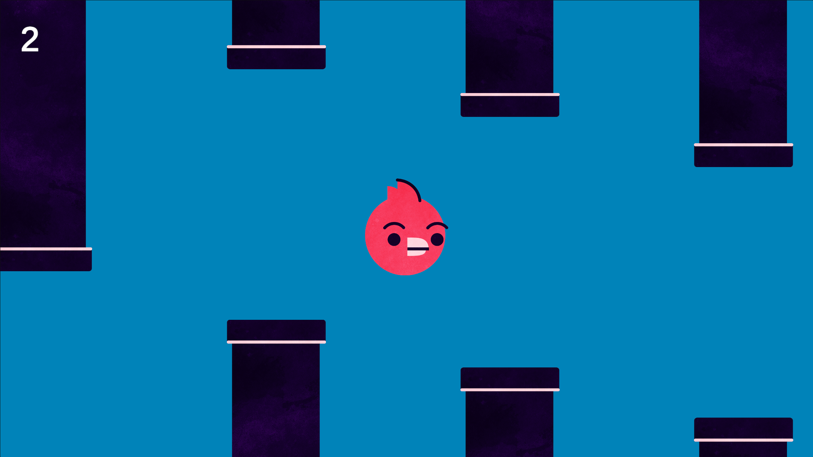

# GAME NAME

A 2D game created using Unity and C#.

## Play the Game

🎮 **[Play or download the game on itch.io]([https://YOUR-USERNAME.itch.io/YOUR-GAME-NAME](https://mahir-labib.itch.io/flapsnap))**

## Screenshots

Add your gameplay screenshots here.

```markdown

```

## Controls

* **Space:** Jump
* **Restart button:** Restart the game
* Avoid the obstacles and collect as many points as possible.

## Features

* Background music
* Jump sound
* Point collection sound
* Game-over sound
* Score system
* Restart system
* Custom game icon and splash screen

## Built With

* Unity
* C#
* Visual Studio

## How to Open the Project

1. Clone or download this repository.
2. Open Unity Hub.
3. Select **Add project from disk**.
4. Select the downloaded project folder.
5. Open the project using the recommended Unity version.

## Download

The latest playable build is available on itch.io:

**[https://YOUR-USERNAME.itch.io/YOUR-GAME-NAME](https://mahir-labib.itch.io/flapsnap)**

## Developer

Created by **Mahir Labib**.
